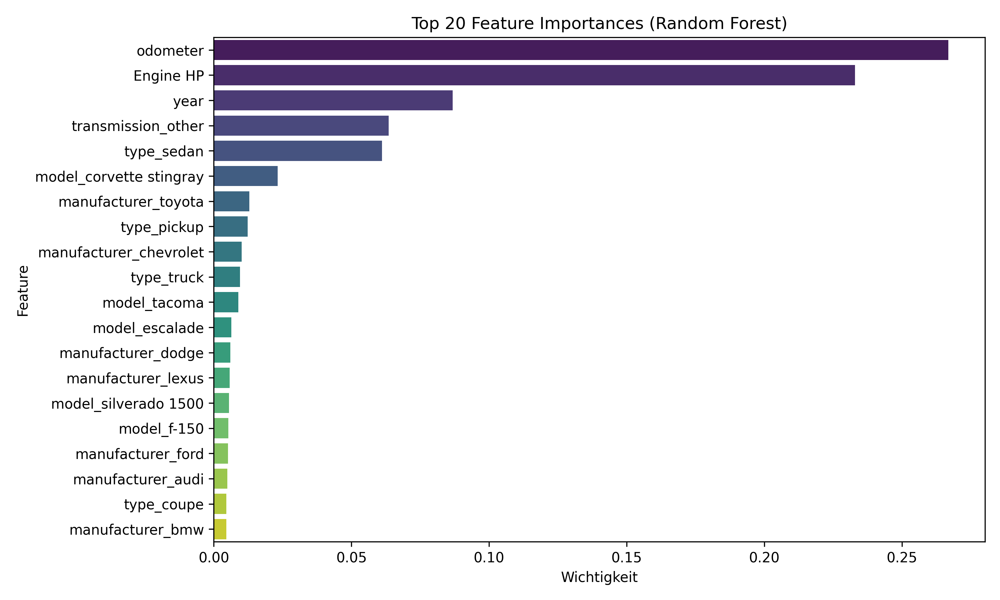

# Car Price Prediction

## Project Description
Predicts Used Car Prices of cars in the USA.

## Results
The Random Forest model demonstrates strong predictive performance, with a high training Score of 0.95 and a test Score of 0.67. The test RMSE of approximately 6,485 indicates a reasonably accurate estimation of car prices. The relatively small gap between training and test performance suggests only mild overfitting.

### Name & URL
| Name          | URL |
|--------------|----|
| Huggingface  | [Huggingface Space](https://huggingface.co/spaces/graftim2/Used_Car_Price_Predictor) |
| Code         | [GitHub Repository](https://github.com/graf-tim/end-to-end-application) |

## Data Sources and Features Used Per Source
| Data Source | Features |
|-------------|----------|
| [Kaggle Craigslist Car Sales Data](https://www.kaggle.com/datasets/austinreese/craigslist-carstrucks-data) | year, manufacturer, model, odometer, type, transmission |
| [Kaggle Car Features and MSRP](https://www.kaggle.com/datasets/CooperUnion/cardataset) | Make, Model, Engine HP |

## Features Created
| Feature | Description |
|---------|-------------|
| manufacturer | One hot encoding of feature manufacturer |
| model | One hot encoding of feature model |
| Engine HP | Horsepower of the car. Merged with other dataset |
| price_per_hp | Price / hp (not used!) |
| age | 2025 - year (not used!) |
| age_cat_encoded | age splitted into groups |
| condition_good | one hot encoding of condition. (not used!) |
| model_group | grouping of only top 20 models (not used!) |
| type | one hot encoding of type. Coupe, SUV, etc.. |
| transmission | one hot encoding of transmission. Automatic / manual / other |

## Model Training
### Amount of Data
- Total of 200'000 Car Listings, limited by Car Feature Dataset and data cleaning to 4592

### Data Splitting Method (Train/Validation/Test)
- 80/20 Train/Test split.

### performance
| It. Nr | Model | Performance | Features | Description |
|--------|--------|-------------|------------|---------------|
| 1 | Linear Regression | Train: 0.09, Test: 0.10,  Train RMSE: 10810, Test RMSE: 10630 | `year, odometer` | Underfitting |
| 2 | Random Forest | Train: 0.86, Test: 0.36,  Train RMSE: 4093, Test RMSE: 8954 | Same as It. 1 | Overfitting |
| 3 | Linear Regression | Train: 0.59, Test: 0.44,  Train RMSE: 7192, Test RMSE: 8405 | Added `manufacturer, model` | light overfitting, Test Score low |
| 4 | Random Forest | Train: 0.94, Test: 0.67,  Train RMSE: 2618, Test RMSE: 6447 | Same as lt. 3 | light Overfitting, Test Score rather high |
| 5 | Random Forest | Mean RMSE: -6584.2 | Same as It. 3 | light Overfitting |
| 6 | Random Forest | Mean RMSE: -6445.6| Added `Engine HP` | light Overfitting, improved |
| 7 | Random Forest | Mean RMSE: -706.0 | Added `price_per_hp` | Used price_per_hp, making it unrealistic (removed!) |
| 8 | Random Forest | Mean RMSE: -6452.2 | Added `age` | slightly worsened (removed!) |
| 9 | Random Forest | Mean RMSE: -6437.2 | Added `age_cat_encoded` | light overfitting, improved |
| 10 | Random Forest | Mean RMSE: -6439.6 | Added `condition_good` | slightly worsened (removed!) |
| 11 | Random Forest | Mean RMSE: -6462.2 | Added `model_grouped` | slightly worsened (removed!) |
| 12 | Random Forest | Mean RMSE: -6345.2 | Added `type` | light Overfitting, improved |
| 13 | Random Forest | Mean RMSE: -6253.2 | Added `transmission` | light Overfitting, improved |

## References
